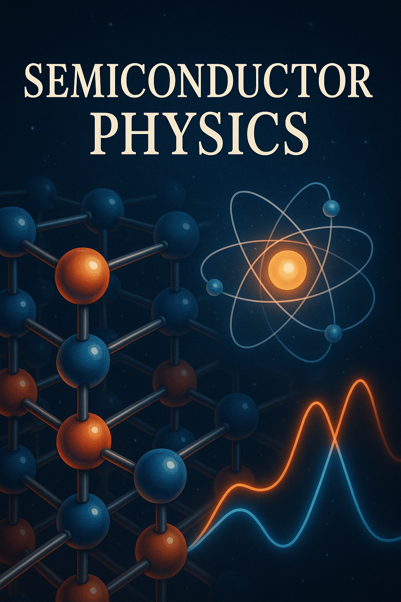

# Semiconductor Physics Course

[](https://creativecommons.org/licenses/by-nc-sa/4.0/)
[](https://dmccreary.github.io/semiconductor-physics-course/)
[](https://www.mkdocs.org/)

> **An interactive educational resource for teaching semiconductor physics with AI-generated simulations and comprehensive course materials.**



## 🎯 Overview

This reposiotory provides a systematic exploration of semiconductor physics, from fundamental quantum mechanical principles to cutting-edge device applications. The course integrates interactive **MicroSims** (small web-based simulations) to help students visualize the impact of fields on electrons and holes in silicon and other crystals.

**🌐 [Visit the Live Course Website](https://dmccreary.github.io/semiconductor-physics-course/)**

## 📚 Course Content

### Foundation Modules

- Quantum mechanics review and statistical mechanics
- Crystal structure and reciprocal lattice concepts
- Band theory and effective mass approximation
- Intrinsic carrier statistics and Fermi-Dirac distribution

### Core Device Physics

- Doping and extrinsic semiconductors
- Carrier transport mechanisms (drift, diffusion, generation-recombination)
- P-n junction physics and diode characteristics
- Bipolar junction transistors (BJTs)
- Field-effect transistors (MOSFETs, JFETs)

### Advanced Topics

- Heterostructures and quantum wells
- Optoelectronic devices (LEDs, photodetectors, solar cells)
- High-frequency and power device considerations
- Semiconductor processing and fabrication impacts on device physics
- Emerging technologies (quantum dots, carbon nanotubes, 2D materials)

## 🎮 Interactive Features

This course leverages AI to generate interactive simulations that explain key semiconductor physics concepts. The MicroSims help students:

- Visualize electron and hole behavior in semiconductor crystals
- Understand the effects of electric fields on charge carriers
- Explore device characteristics through interactive models
- Bridge the gap between theoretical concepts and practical applications

## 🎓 Learning Objectives

By the end of this course, students will be able to:

### Knowledge and Comprehension

- Define key concepts including energy bands, carrier statistics, and doping mechanisms
- Explain the quantum mechanical origins of semiconductor behavior
- Describe crystal structures and their impact on electronic properties

### Application and Analysis

- Calculate carrier concentrations in intrinsic and extrinsic semiconductors
- Solve problems involving drift and diffusion currents
- Analyze band diagrams for various semiconductor structures
- Apply continuity equations to model device behavior

### Evaluation and Creation

- Evaluate trade-offs in semiconductor device design choices
- Design basic semiconductor devices to meet specified performance criteria
- Propose solutions to engineering challenges using semiconductor principles

## 🏗️ Built With

- **[MkDocs](https://www.mkdocs.org/)** - Static site generator
- **[Material Theme](https://squidfunk.github.io/mkdocs-material/)** - Modern documentation theme
- **Interactive Simulations** - AI-generated web-based MicroSims
- **Markdown** - Content authoring

## 🚀 Getting Started

### Prerequisites

To fully benefit from this course, students should have:

- Solid foundation in calculus-based physics
- Basic quantum mechanics and statistical mechanics
- Differential equations and linear algebra
- Introduction to materials science concepts

### Local Development

1. **Clone the repository**
   ```bash
   git clone https://github.com/dmccreary/semiconductor-physics-course.git
   cd semiconductor-physics-course
   ```

2. **Install MkDocs and dependencies**
   ```bash
   pip install mkdocs mkdocs-material
   ```

3. **Serve the site locally**
   ```bash
   mkdocs serve
   ```

4. **Open in browser**
   Navigate to `http://127.0.0.1:8000`

### Building for Production

```bash
mkdocs build
```

The static site will be generated in the `site/` directory.

## 📖 Course Structure

```
docs/
├── index.md                    # Course homepage
├── about.md                    # About this course
├── course-description.md       # Detailed course description
├── prompts/                    # AI prompts for generating content
│   ├── index.md
│   └── suggested-simulations.md
├── sims/                       # Interactive simulations
│   ├── index.md
│   └── pn-junction/
├── glossary.md                 # Key terms and definitions
├── references.md               # Academic references
└── contact.md                  # Contact information
```

## 🤝 Contributing

We welcome contributions to improve the course content and simulations! Here's how you can help:

1. **Fork the repository**
2. **Create a feature branch** (`git checkout -b feature/AmazingFeature`)
3. **Commit your changes** (`git commit -m 'Add some AmazingFeature'`)
4. **Push to the branch** (`git push origin feature/AmazingFeature`)
5. **Open a Pull Request**

## 📧 Contact

**Dan McCreary** - Course Author
- LinkedIn: [danmccreary](https://www.linkedin.com/in/danmccreary/)
- GitHub: [@dmccreary](https://github.com/dmccreary)

## 📄 License

This project is licensed under the **Creative Commons Attribution-NonCommercial-ShareAlike 4.0 International License**.

[](https://creativecommons.org/licenses/by-nc-sa/4.0/)

You are free to:
- **Share** — copy and redistribute the material in any medium or format
- **Adapt** — remix, transform, and build upon the material

Under the following terms:
- **Attribution** — You must give appropriate credit
- **NonCommercial** — You may not use the material for commercial purposes
- **ShareAlike** — If you remix, transform, or build upon the material, you must distribute your contributions under the same license

## 🌟 Acknowledgments

- Thanks to the open-source community for the tools and resources that make this course possible
- Special recognition to educators and researchers advancing semiconductor physics education
- Appreciation for AI tools that enable interactive simulation generation

---

**🎓 Ready to explore the fascinating world of semiconductor physics?**  
[**Start the Course →**](https://dmccreary.github.io/semiconductor-physics-course/)