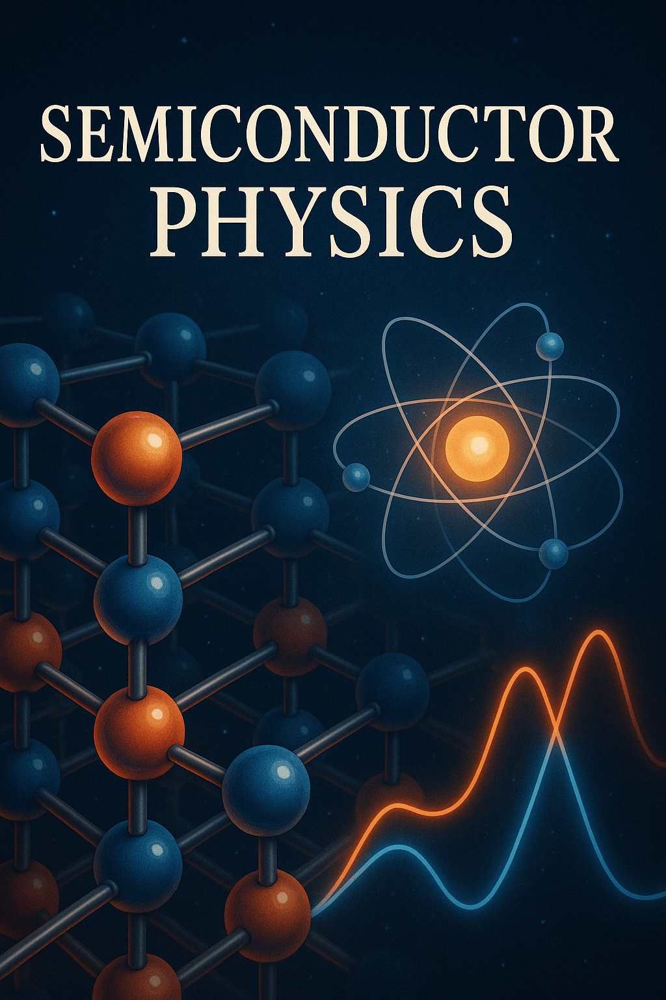

# Semiconductor Physics

Welcome to the Semiconductor Phycsics Intelligent Textbook.
This course is use as a teaching tool to help instructors create
courses in semiconductor physics.  We focus on using AI to
generate simulations that explain key concepts.

Please contact me on [LinkedIn](https://www.linkedin.com/in/danmccreary/) if you have
any questions about the textbook.