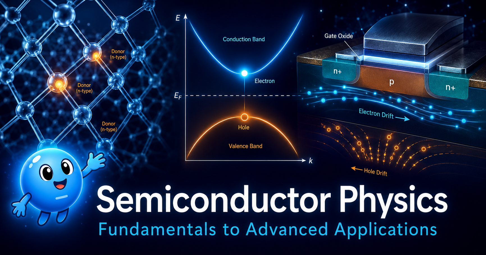

# Semiconductor Physics

<figure markdown>
  { width="100%" }
</figure>

Welcome to the **Semiconductor Physics** intelligent textbook — an open-source, interactive course that takes you from the quantum mechanical origins of energy bands all the way to FinFETs, laser diodes, and modern fabrication technology.

This textbook is designed for college juniors, seniors, and first-year graduate students in electrical engineering, applied physics, materials science, and engineering physics. Working engineers looking for a rigorous refresher will find it equally useful.

## How to Use This Book

The 22 chapters build on one another in prerequisite order — concepts are introduced only after their foundations are established. Reading sequentially is recommended, but you can use the [Learning Graph](learning-graph/index.md) to explore connections non-linearly or diagnose gaps in your background.

### Chapters

| # | Topic |
|---|-------|
| [1](chapters/01-intro-semiconductors/index.md) | Introduction to Semiconductors and Bandgap Fundamentals |
| [2](chapters/02-crystal-lattice-structure/index.md) | Crystal Lattice Structure |
| [3](chapters/03-crystal-bonding-defects/index.md) | Crystal Bonding and Defects |
| [4](chapters/04-quantum-mechanics/index.md) | Quantum Mechanics for Semiconductors |
| [5](chapters/05-bloch-theorem-band-theory/index.md) | Bloch Theorem and Band Theory |
| [6](chapters/06-fermi-dirac-statistics/index.md) | Fermi-Dirac Statistics |
| [7](chapters/07-doping-extrinsic-carriers/index.md) | Doping and Extrinsic Carriers |
| [8](chapters/08-carrier-drift-mobility/index.md) | Carrier Drift and Mobility |
| [9](chapters/09-carrier-diffusion-transport/index.md) | Carrier Diffusion and Transport |
| [10](chapters/10-generation-recombination/index.md) | Generation and Recombination |
| [11](chapters/11-pn-junction-equilibrium/index.md) | P-N Junction Equilibrium |
| [12](chapters/12-pn-junction-dynamics/index.md) | P-N Junction Dynamics |
| [13](chapters/13-metal-semiconductor-mos/index.md) | Metal-Semiconductor and MOS Structures |
| [14](chapters/14-bipolar-transistors/index.md) | Bipolar Junction Transistors |
| [15](chapters/15-jfet-mesfet-mosfet/index.md) | JFET, MESFET, and MOSFET |
| [16](chapters/16-short-channel-cmos/index.md) | Short-Channel Effects and CMOS |
| [17](chapters/17-leds-laser-diodes/index.md) | LEDs and Laser Diodes |
| [18](chapters/18-photodetectors-solar-cells/index.md) | Photodetectors and Solar Cells |
| [19](chapters/19-compound-semiconductors-quantum/index.md) | Compound Semiconductors and Quantum Structures |
| [20](chapters/20-strained-si-2d-power/index.md) | Strained Silicon, 2D Materials, and Power Devices |
| [21](chapters/21-fabrication-technology/index.md) | Fabrication Technology |
| [22](chapters/22-characterization-modeling/index.md) | Characterization and Modeling |

### Interactive MicroSims

The textbook includes **16 browser-based MicroSims** that let you manipulate device parameters and observe effects in real time — no installation required.

[Browse all MicroSims](sims/index.md){ .md-button }

Highlights:

- [E-k Band Structure Explorer](sims/ek-band-structure-explorer/index.md) — visualize energy bands for Si, Ge, and GaAs
- [Fermi-Dirac Distribution Explorer](sims/fermi-dirac-explorer/index.md) — sweep temperature and doping
- [PN Junction](sims/pn-junction/index.md) — apply forward and reverse bias, watch depletion width change
- [Quantum Tunneling Probability Explorer](sims/quantum-tunneling-explorer/index.md) — vary barrier height and width
- [Learning Graph Viewer](sims/graph-viewer/index.md) — explore all 600 concepts and their dependencies

### Reference Resources

| Resource | Description |
|----------|-------------|
| [Learning Graph](learning-graph/index.md) | Interactive map of all 600 concepts and their prerequisites |
| [Glossary](glossary.md) | Definitions for every key term in the course |
| [FAQ](faq.md) | Answers to common questions |
| [About](about.md) | Author bio, motivation, and citation formats |
| [Course Description](course-description.md) | Full syllabus with learning outcomes and topic list |

## Get Started

[Chapter 1: Introduction to Semiconductors](chapters/01-intro-semiconductors/index.md){ .md-button .md-button--primary }
[Learning Graph](learning-graph/index.md){ .md-button }

---

Questions or feedback? Reach out on [LinkedIn](https://www.linkedin.com/in/danmccreary/) or visit the [Contact](contact.md) page.
