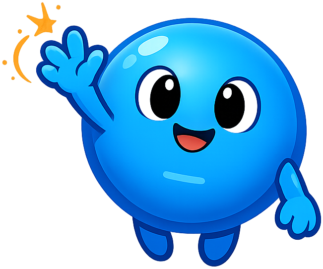

# Mascot Style Guide

This page shows all of Nova's admonition styles for reference. Use it to
verify that the CSS, image paths, and admonition extensions are all
working correctly after installing the mascot.

!!! mascot-neutral "A Note from Nova"
    
    This is the neutral style, used for general sidebars or notes that
    don't call for a specific emotional tone. Nova is just here to keep
    you company.

!!! mascot-welcome "Welcome, fellow particles!"
    
    *Let's get excited!* This is the welcome style, used at chapter
    openings. Get ready to dive into the quantum world of semiconductors.

!!! mascot-thinking "Key Insight"
    
    This is the thinking style, used for key concepts. The band gap isn't
    a wall — it's a forbidden zone where no electron states exist. Bigger
    gap, fewer thermally excited carriers.

!!! mascot-tip "Nova's Tip"
    
    This is the tip style, used for hints. When sketching a band diagram,
    always draw the Fermi level first — everything else hangs off it.

!!! mascot-warning "Watch Out!"
    
    This is the warning style, used for common mistakes. Don't confuse
    drift current with diffusion current — they have different driving
    forces (field vs. concentration gradient) even though both move
    charge.

!!! mascot-encourage "You've got this!"
    
    This is the encouraging style, used for difficult content. Quantum
    mechanics feels weird at first — that's normal. Trust the math, and
    the intuition will follow.

!!! mascot-celebration "Field's looking good!"
    
    This is the celebration style, used at the end of a chapter or after
    mastering a tough derivation. You just leveled up — *time to jump
    bands!*

---

## Verification checklist

- [ ] All seven mascot images load (no broken-image icons)
- [ ] Each admonition has the correct color in its title bar
- [ ] Nova's image is floated left of the body text
- [ ] Text wraps cleanly around the image
- [ ] On the celebration admonition, the dark background makes the
      sparks/confetti pop
- [ ] On mobile / narrow viewports, the image and text still read well
