# List of MicroSims for Semiconductor Physics

Interactive Micro Simulations to help students learn the foundations of
semiconductor physics — crystal structure, quantum mechanics, band
theory, carrier statistics, and defects. Each MicroSim is a small,
self-contained interactive that runs in the browser.

-   **[Crystal Defect Hierarchy Network](./defect-hierarchy-network/index.md)**

    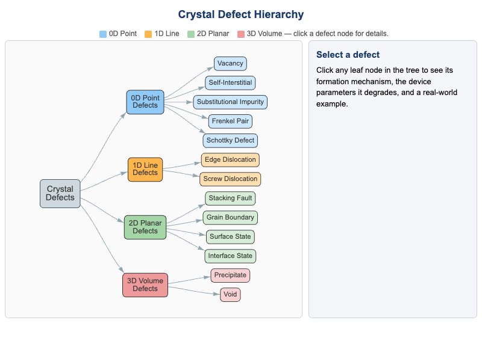

    Clickable hierarchical tree of crystal defects classified by
    dimensionality (0D point, 1D line, 2D planar, 3D volume). Click
    any leaf node for the formation mechanism, degraded device
    parameters, and a real-world example.

-   **[Cubic Crystal Structure Explorer](./cubic-crystal-structure-explorer/index.md)**

    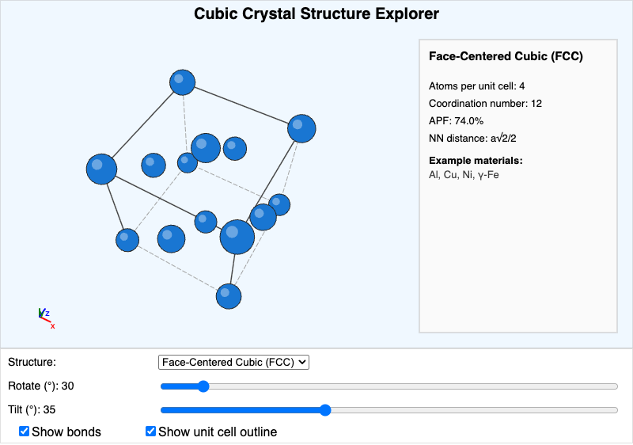

    3D conventional unit cells for simple cubic, BCC, FCC, diamond,
    and zincblende structures with rotation and tilt controls. Reports
    atoms per cell, coordination number, APF, and nearest-neighbor
    distance.

-   **[Dimensionality and Density of States Explorer](./density-of-states-explorer/index.md)**

    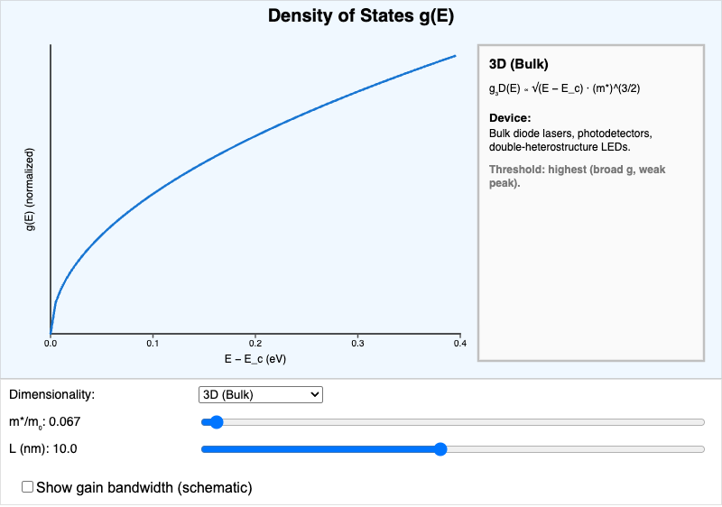

    Plots g(E) for 3D bulk, 2D quantum well, 1D quantum wire, and 0D
    quantum dot systems with adjustable effective mass and
    confinement width. Shows how DOS shape drives laser threshold.

-   **[Direct vs. Indirect Bandgap E-k Explorer](./direct-indirect-bandgap-explorer/index.md)**

    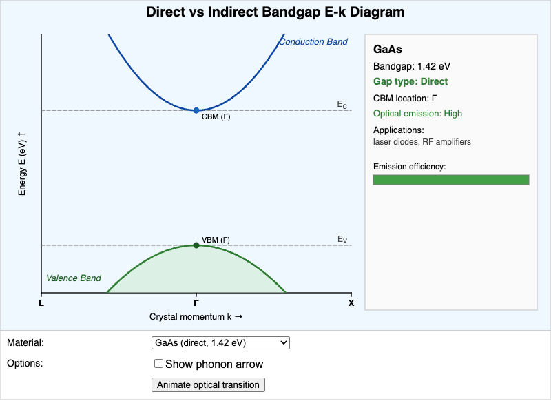

    E-k diagrams for GaAs, InP, GaN, Silicon, and Germanium showing
    whether the CBM and VBM coincide in k-space. Animates the optical
    transition and the phonon assist required for indirect gaps.

-   **[Energy Band Diagram Explorer](./energy-band-diagram-explorer/index.md)**

    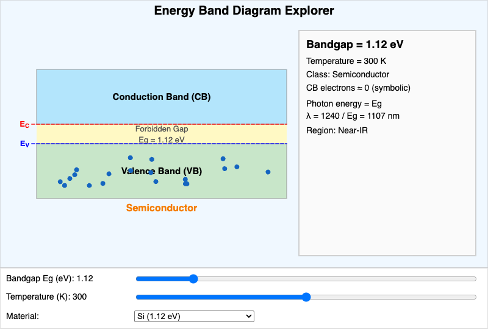

    Interactive conduction band, valence band, and forbidden gap with
    adjustable E_g and temperature. Classifies the material as
    conductor, semiconductor, or insulator and computes the emission
    wavelength.

-   **[E-k Band Structure Explorer](./ek-band-structure-explorer/index.md)**

    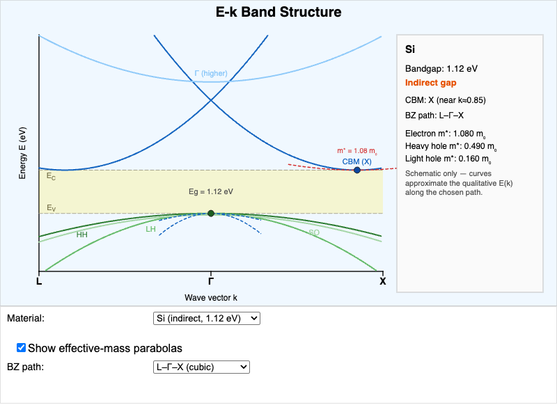

    Schematic E-k bands along high-symmetry directions for Si, Ge,
    GaAs, GaN, and the free-electron case. Toggle effective-mass
    parabolas to read m_n*, m_HH, and m_LH off the curvature.

-   **[Fermi-Dirac Distribution and Carrier Concentration Explorer](./fermi-dirac-explorer/index.md)**

    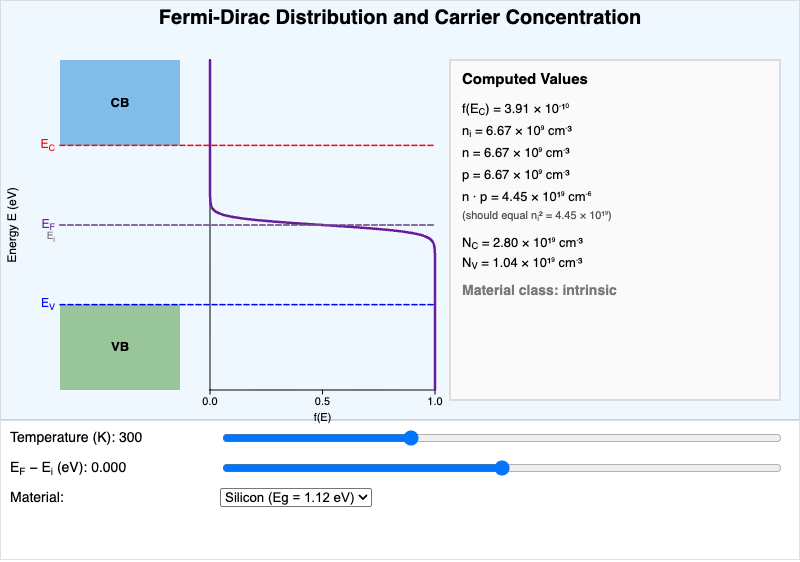

    Fermi-Dirac sigmoid plotted alongside an energy band diagram.
    Adjust temperature and Fermi level to see electron and hole
    concentrations, the n·p product, and the n/p/intrinsic
    classification update in real time.

-   **[Learning Graph Viewer](./graph-viewer/index.md)**

    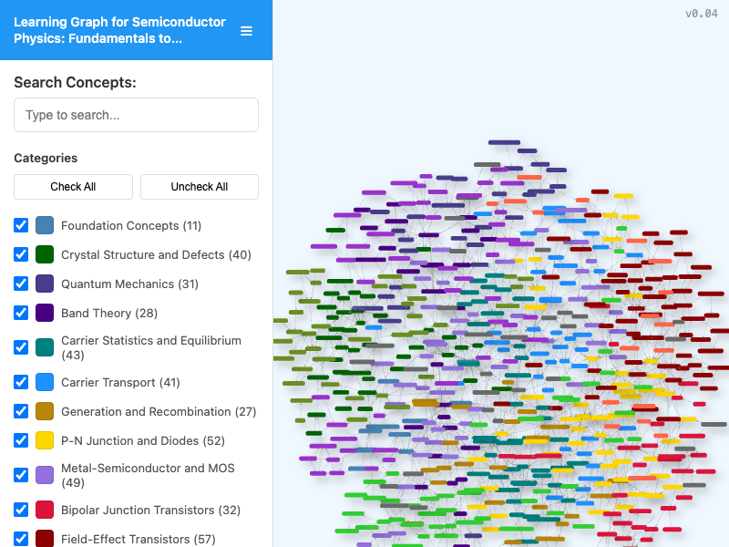

    Interactive viewer for the course learning graph. Search for
    concepts, filter by taxonomy category, and pan/zoom to explore
    dependency relationships across the 200 concepts in the course.

-   **[Miller Indices Crystal Plane Explorer](./miller-indices-explorer/index.md)**

    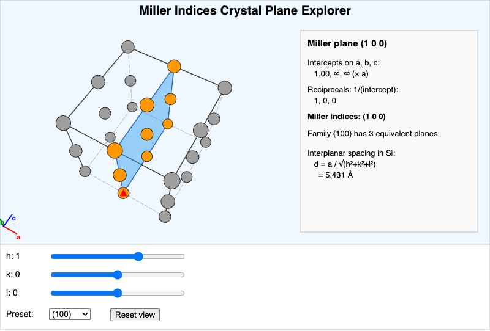

    Visualize the (hkl) plane through a 2×2×2 cubic supercell.
    Sliders for h, k, l plus a preset menu. Shows intercepts,
    reciprocals, the family count, and the interplanar spacing in
    silicon.

-   **[P-N Junction Voltage Explorer](./pn-junction/index.md)**

    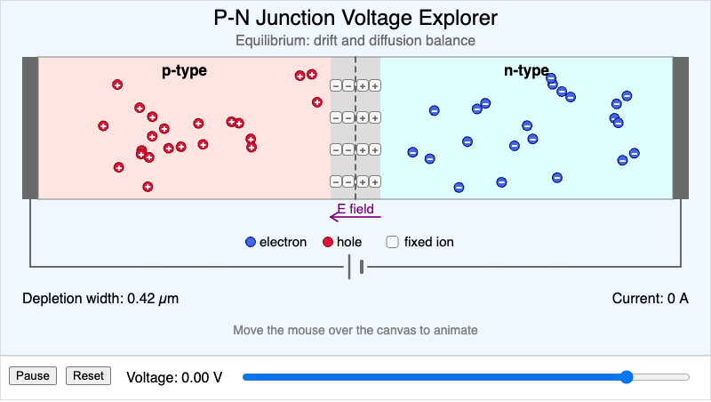

    Cross-section of a silicon p-n junction under bias. A voltage
    slider sweeps from −5 V to +0.75 V while the depletion region,
    exposed dopant ions, electric field, and animated carriers
    respond. Readouts show depletion width and Shockley diode
    current.

-   **[Particle in a Box Energy Level Explorer](./particle-in-a-box-explorer/index.md)**

    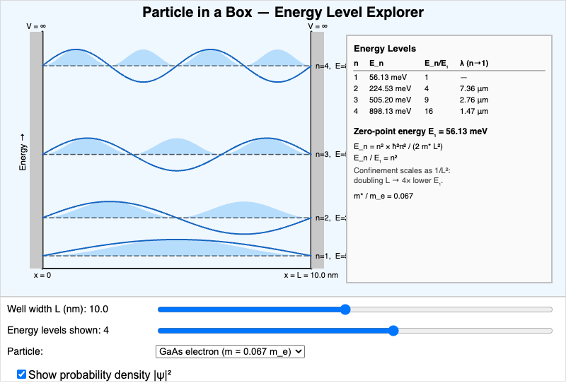

    Quantized energy levels and wave functions of a 1D infinite
    well. Adjust the width L, the particle effective mass, and the
    number of levels shown. Optionally overlay |ψ|² probability
    densities.

-   **[Point Defect Visualizer](./point-defect-visualizer/index.md)**

    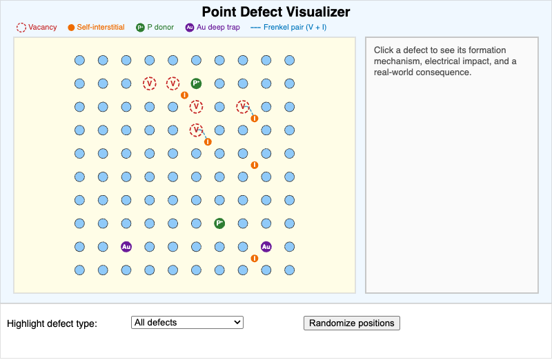

    Top-down view of a 10×10 lattice cross-section with vacancies,
    self-interstitials, substitutional donors (P), substitutional
    deep traps (Au), and Frenkel pairs. Click any defect to see its
    mechanism and electrical impact.

-   **[Quantum Tunneling Probability Explorer](./quantum-tunneling-explorer/index.md)**

    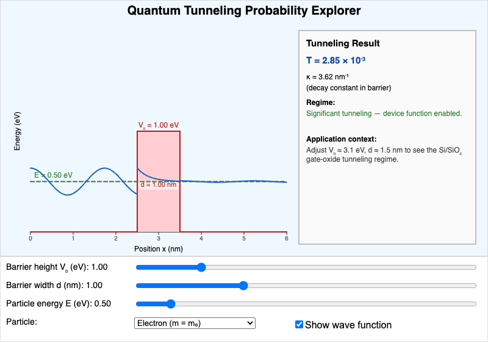

    Rectangular potential barrier with adjustable height V₀, width d,
    and incident energy E. Shows the wave function shape and the
    exact transmission probability T, including the gate-oxide
    leakage regime that drove high-κ dielectrics.

-   **[Semiconductor Lattice Constant and Bandgap Map](./lattice-bandgap-map/index.md)**

    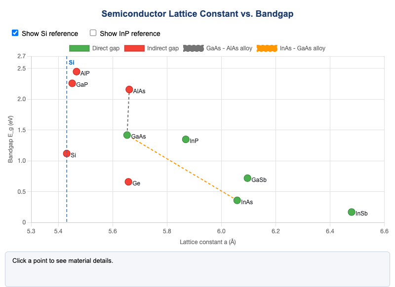

    Scatter plot of common III-V and group-IV semiconductors by
    lattice constant and bandgap. Direct-gap (green) vs indirect-gap
    (red) color coding with alloy interpolation lines for
    heterostructure design.

-   **[Temperature Dependence of n_i Explorer](./intrinsic-concentration-temperature/index.md)**

    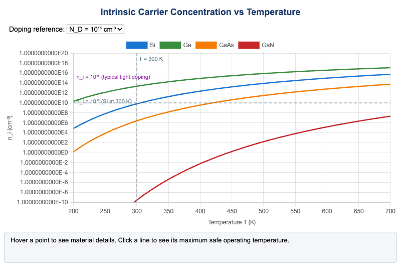

    Intrinsic carrier concentration n_i(T) on a log scale for Si,
    Ge, GaAs, and GaN from 200–700 K. Click a line to see the
    maximum safe operating temperature for a chosen doping level.

