# List of MicroSims for Semiconductor Physics

Interactive Micro Simulations to help students learn the foundations of
semiconductor physics — crystal structure, quantum mechanics, band
theory, carrier statistics, and defects. Each MicroSim is a small,
self-contained interactive that runs in the browser.

-   **[BJT Operating Regions Explorer](./bjt-operating-regions/index.md)**

    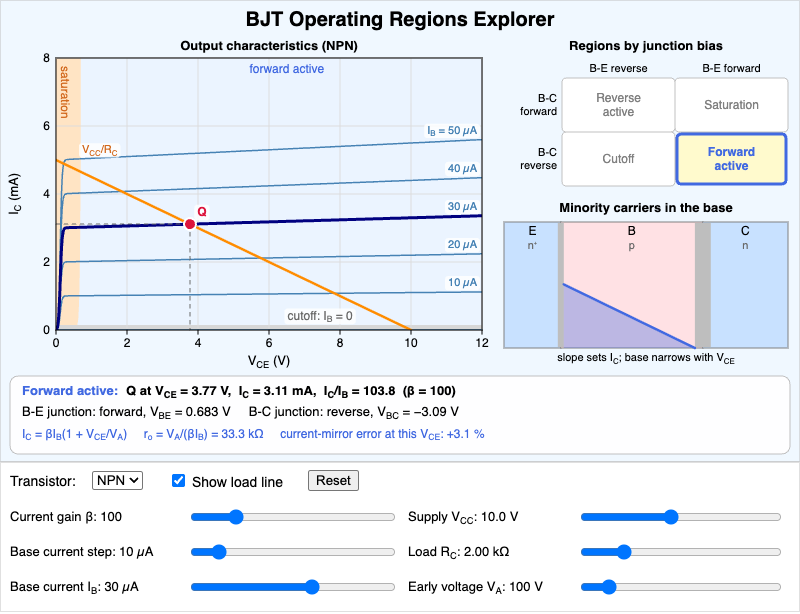

    Output characteristics of a bipolar transistor with a load line
    and the DC operating point. See saturation, forward active, and
    cutoff, how they follow from the two junction biases, and how
    the Early voltage tilts the curves.

-   **[Carrier Concentration vs. Temperature](./carrier-vs-temperature-explorer/index.md)**

    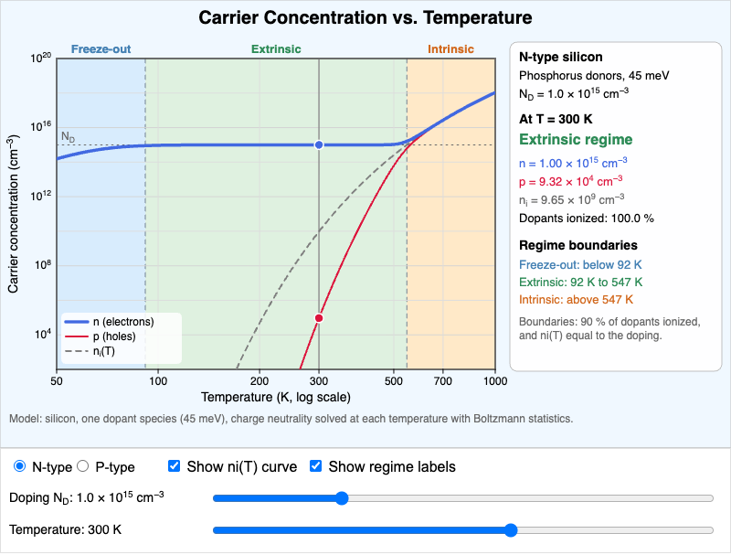

    Log-scale plot of n(T) and p(T) in doped silicon from 50 K to
    1000 K with the freeze-out, extrinsic, and intrinsic regimes
    shaded. Change the doping type and concentration to see the
    regime boundaries move.

-   **[Carrier Mobility Explorer](./carrier-mobility-explorer/index.md)**

    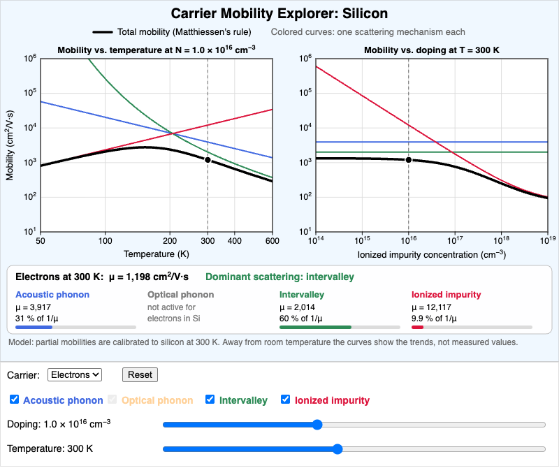

    Log-log plots of electron or hole mobility in silicon against
    temperature and doping, with one curve per scattering mechanism.
    Switch mechanisms on and off to see Matthiessen's rule set the
    total.

-   **[Crystal Defect Hierarchy Network](./defect-hierarchy-network/index.md)**

    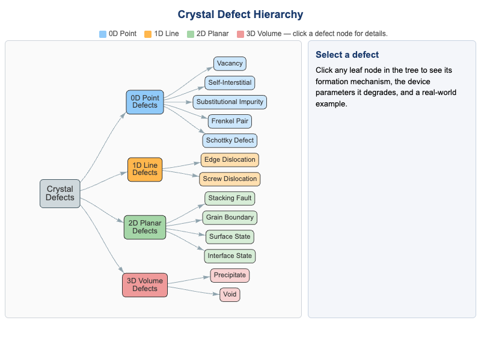

    Clickable hierarchical tree of crystal defects classified by
    dimensionality (0D point, 1D line, 2D planar, 3D volume). Click
    any leaf node for the formation mechanism, degraded device
    parameters, and a real-world example.

-   **[Cubic Crystal Structure Explorer](./cubic-crystal-structure-explorer/index.md)**

    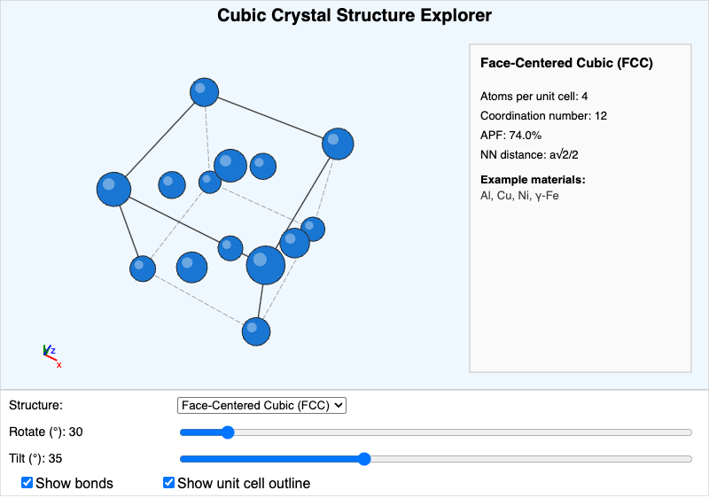

    3D conventional unit cells for simple cubic, BCC, FCC, diamond,
    and zincblende structures with rotation and tilt controls. Reports
    atoms per cell, coordination number, APF, and nearest-neighbor
    distance.

-   **[Dimensionality and Density of States Explorer](./density-of-states-explorer/index.md)**

    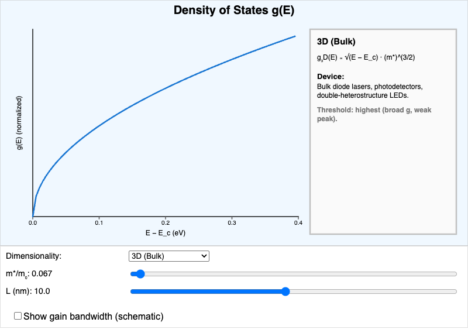

    Plots g(E) for 3D bulk, 2D quantum well, 1D quantum wire, and 0D
    quantum dot systems with adjustable effective mass and
    confinement width. Shows how DOS shape drives laser threshold.

-   **[Direct vs. Indirect Bandgap E-k Explorer](./direct-indirect-bandgap-explorer/index.md)**

    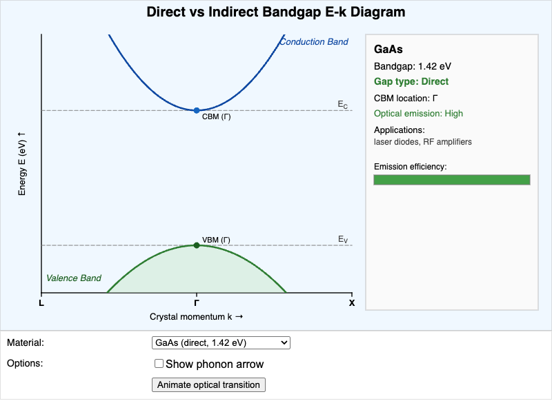

    E-k diagrams for GaAs, InP, GaN, Silicon, and Germanium showing
    whether the CBM and VBM coincide in k-space. Animates the optical
    transition and the phonon assist required for indirect gaps.

-   **[Dopant Ionization Fraction vs. Temperature](./dopant-ionization-explorer/index.md)**

    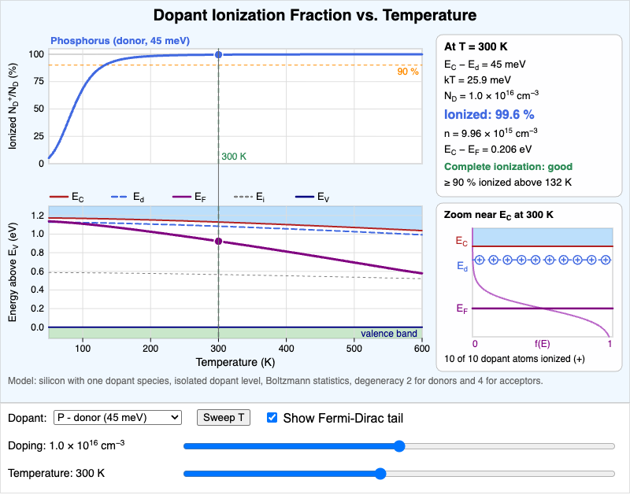

    Fraction of ionized donors or acceptors in silicon from 50 K to
    600 K, with a band diagram tracking the Fermi level against the
    dopant level. Choose the dopant (P, As, Sb, B, Ga, Al, In), the
    doping concentration, and a probe temperature.

-   **[Energy Band Diagram Explorer](./energy-band-diagram-explorer/index.md)**

    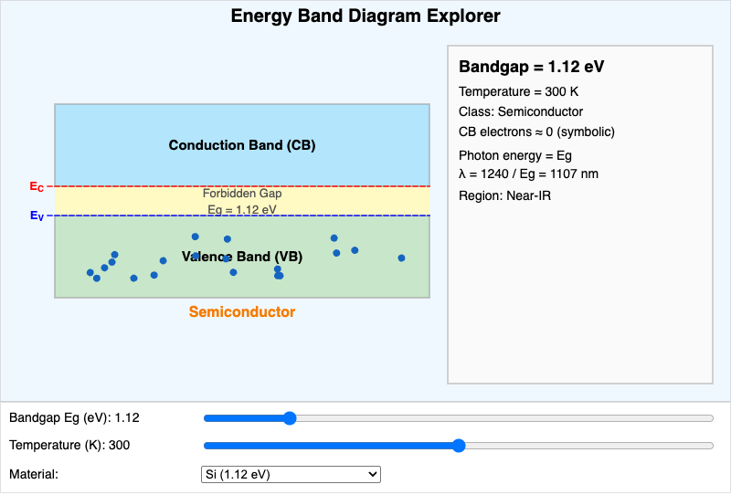

    Interactive conduction band, valence band, and forbidden gap with
    adjustable E_g and temperature. Classifies the material as
    conductor, semiconductor, or insulator and computes the emission
    wavelength.

-   **[E-k Band Structure Explorer](./ek-band-structure-explorer/index.md)**

    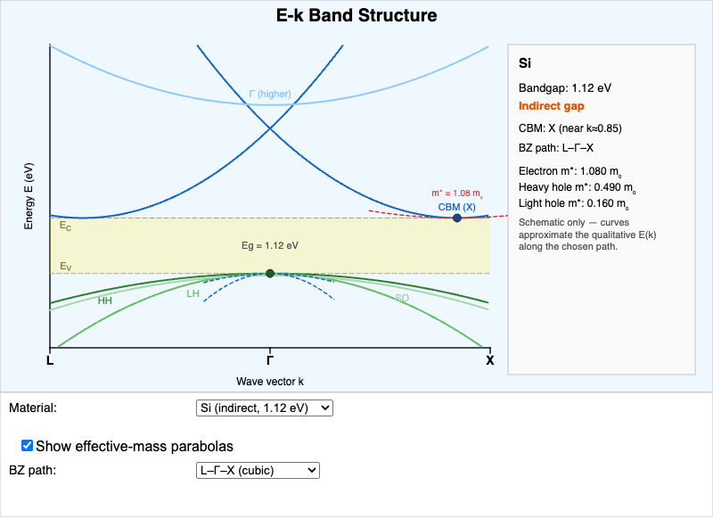

    Schematic E-k bands along high-symmetry directions for Si, Ge,
    GaAs, GaN, and the free-electron case. Toggle effective-mass
    parabolas to read m_n*, m_HH, and m_LH off the curvature.

-   **[Fermi-Dirac Distribution and Carrier Concentration Explorer](./fermi-dirac-explorer/index.md)**

    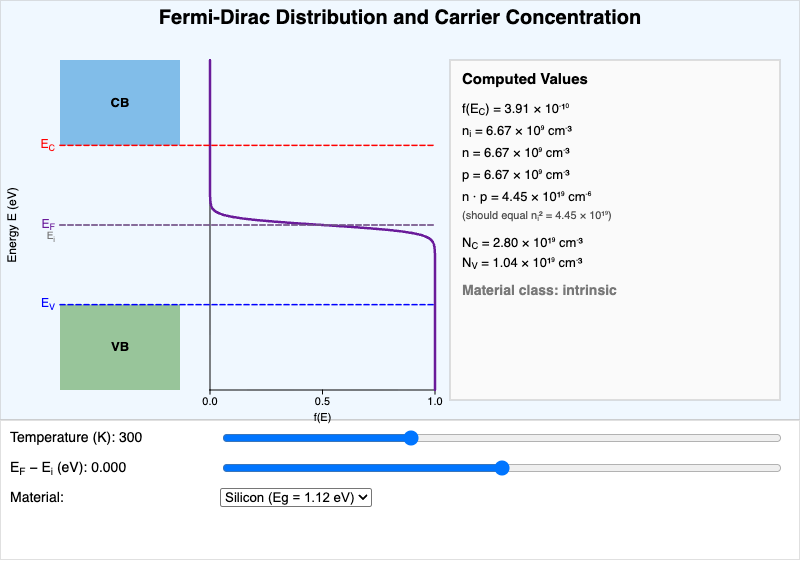

    Fermi-Dirac sigmoid plotted alongside an energy band diagram.
    Adjust temperature and Fermi level to see electron and hole
    concentrations, the n·p product, and the n/p/intrinsic
    classification update in real time.

-   **[Hall Effect Measurement Simulator](./hall-effect-simulator/index.md)**

    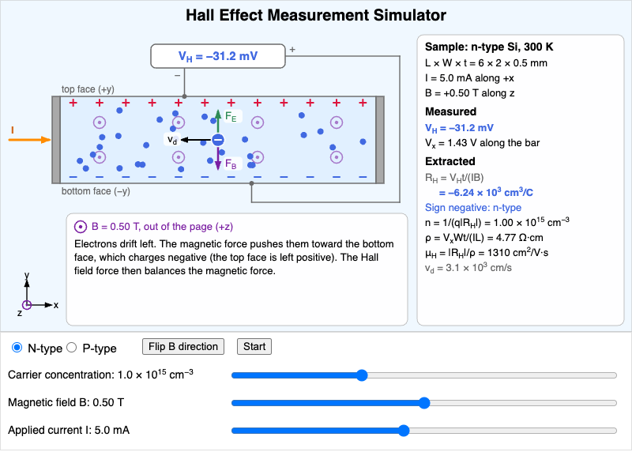

    Top view of a silicon Hall bar in a magnetic field. Carriers are
    pushed toward one face and a voltmeter reads the Hall voltage.
    Extract carrier type, concentration, and Hall mobility, and flip
    the field or the doping type to see the sign change.

-   **[Heterojunction Band Alignment Visualizer](./heterojunction-band-alignment/index.md)**

    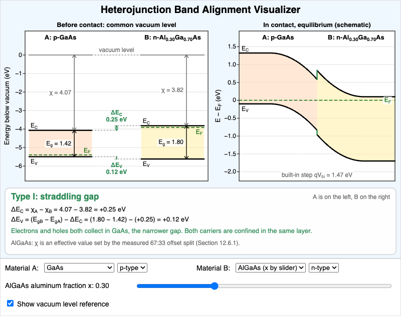

    Pick two semiconductors and see their bands lined up on a common
    vacuum level. The sim applies Anderson's rule, shows both band
    offsets, and classifies the junction as Type I, II, or III.
    Includes an AlGaAs composition slider.

-   **[LED Efficiency and Laser Threshold Explorer](./led-laser-efficiency-explorer/index.md)**

    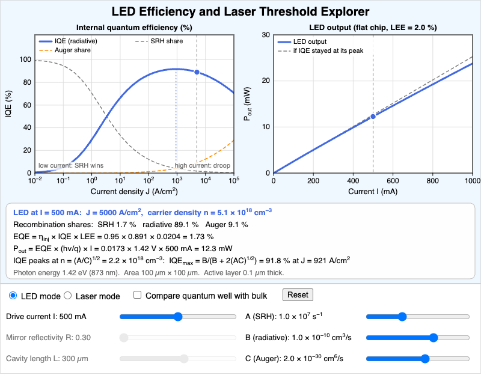

    LED mode shows the efficiency droop of the ABC recombination
    model. Laser mode finds the threshold where modal gain equals
    cavity loss and draws the light-current curve. Adjust the
    recombination coefficients, mirror reflectivity, and cavity length.

-   **[Learning Graph Viewer](./graph-viewer/index.md)**

    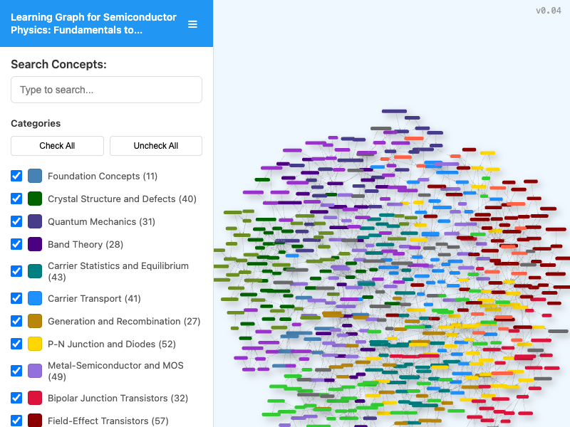

    Interactive viewer for the course learning graph. Search for
    concepts, filter by taxonomy category, and pan/zoom to explore
    dependency relationships across the 200 concepts in the course.

-   **[Long-Channel MOSFET I-V Explorer](./mosfet-iv-long-channel/index.md)**

    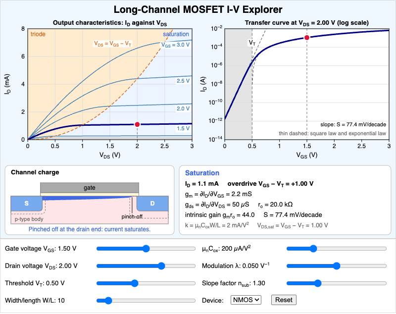

    Square-law output curves and the logarithmic transfer curve of a
    long-channel MOSFET. Shows triode, saturation, and subthreshold
    operation, channel pinch-off, and the transconductance and output
    conductance at any operating point.

-   **[Miller Indices Crystal Plane Explorer](./miller-indices-explorer/index.md)**

    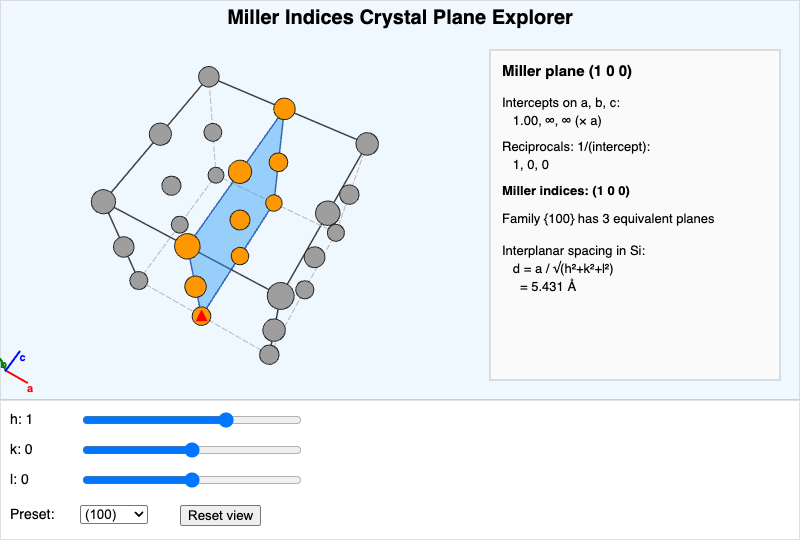

    Visualize the (hkl) plane through a 2×2×2 cubic supercell.
    Sliders for h, k, l plus a preset menu. Shows intercepts,
    reciprocals, the family count, and the interplanar spacing in
    silicon.

-   **[Minority Carrier Diffusion Length Visualizer](./minority-carrier-diffusion/index.md)**

    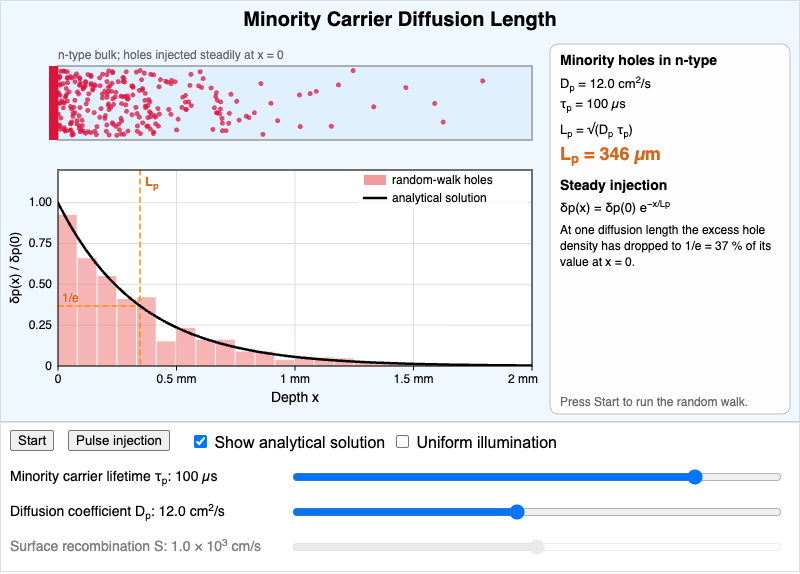

    Holes random-walk into n-type material and recombine. A histogram
    of the walkers is compared with the analytical profile while
    sliders for lifetime and diffusivity set the diffusion length.
    Includes pulse injection and a recombining surface.

-   **[MOS Capacitor C-V Explorer](./mos-cv-explorer/index.md)**

    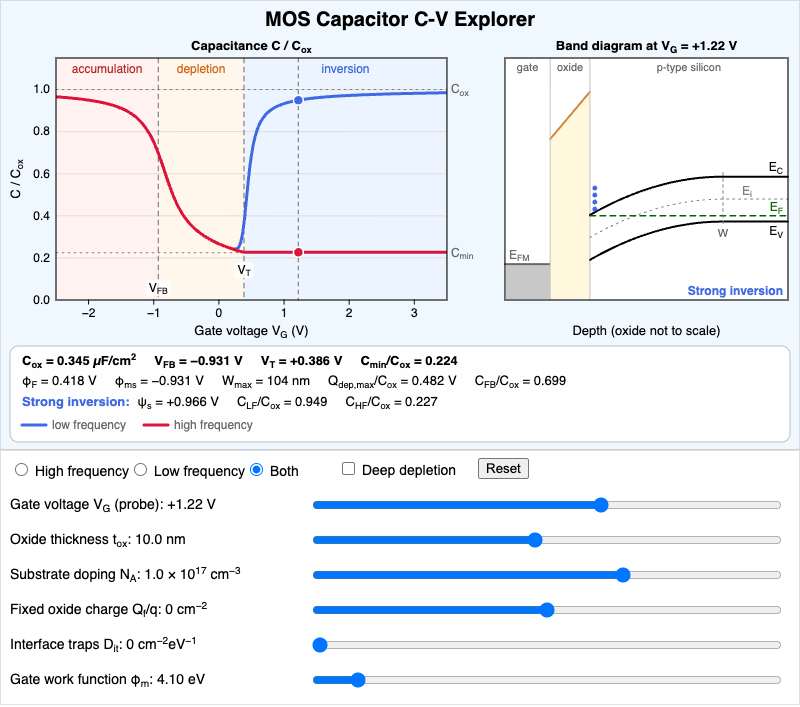

    High- and low-frequency C-V curves of a MOS capacitor with the
    band diagram at a chosen gate voltage. Change the oxide
    thickness, doping, oxide charge, interface traps, and gate work
    function to see the curve shift and stretch.

-   **[MOSFET Scaling Simulator](./mosfet-scaling-simulator/index.md)**

    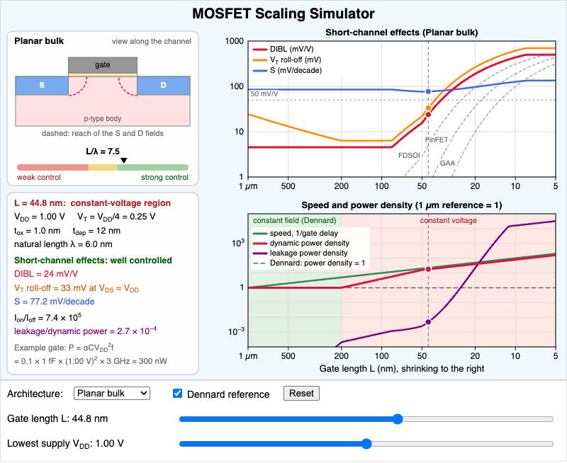

    Shrink a transistor from 1 µm to 5 nm. A trend model shows DIBL,
    threshold roll-off, subthreshold slope, speed, and power density
    for planar, FDSOI, FinFET, and gate-all-around devices, and where
    Dennard scaling stops.

-   **[P-N Junction Explorer](./pn-junction-explorer/index.md)**

    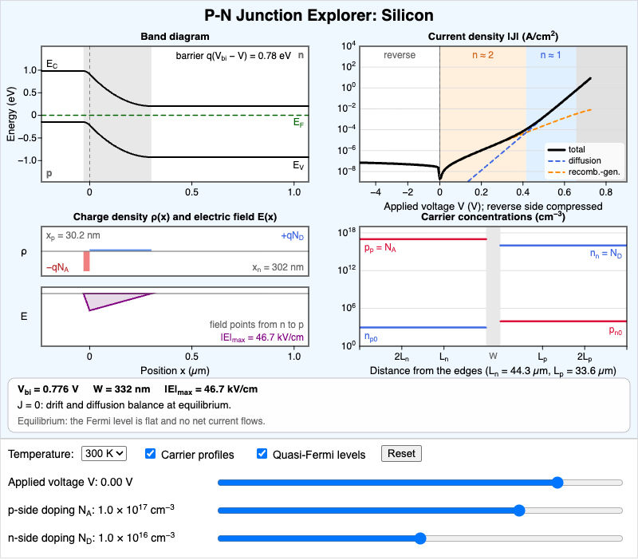

    Four linked plots for a silicon p-n junction: band diagram,
    charge and field, current against voltage, and carrier profiles.
    Set the bias, the doping on each side, and the temperature, and
    see which current component dominates.

-   **[P-N Junction Voltage Explorer](./pn-junction/index.md)**

    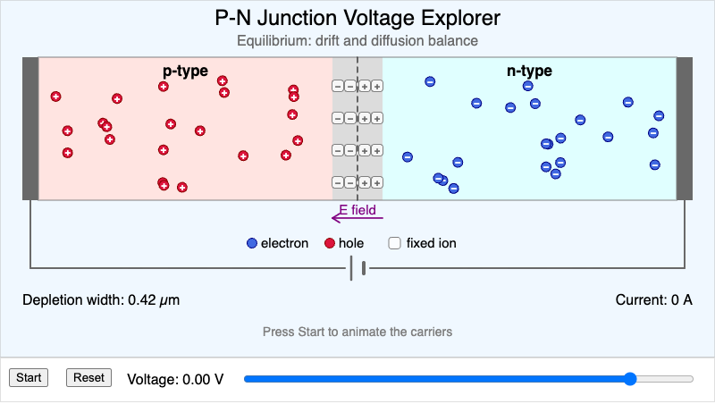

    Cross-section of a silicon p-n junction under bias. A voltage
    slider sweeps from −5 V to +0.75 V while the depletion region,
    exposed dopant ions, electric field, and animated carriers
    respond. Readouts show depletion width and Shockley diode
    current.

-   **[Particle in a Box Energy Level Explorer](./particle-in-a-box-explorer/index.md)**

    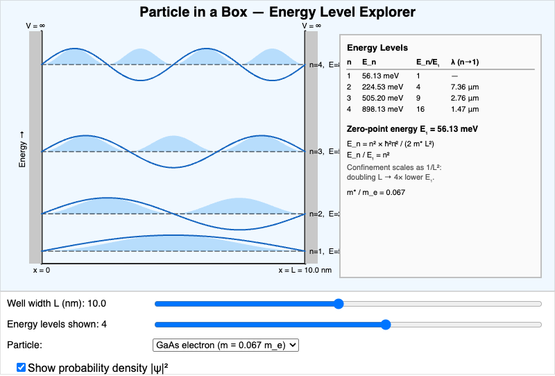

    Quantized energy levels and wave functions of a 1D infinite
    well. Adjust the width L, the particle effective mass, and the
    number of levels shown. Optionally overlay |ψ|² probability
    densities.

-   **[Point Defect Visualizer](./point-defect-visualizer/index.md)**

    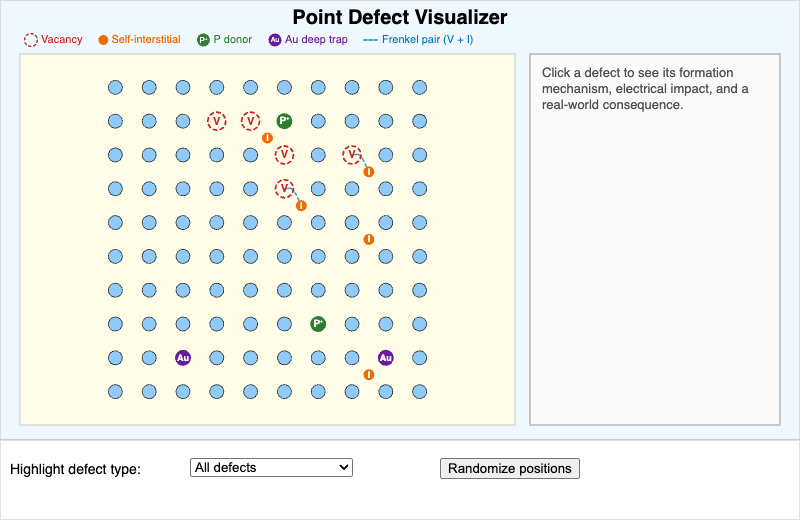

    Top-down view of a 10×10 lattice cross-section with vacancies,
    self-interstitials, substitutional donors (P), substitutional
    deep traps (Au), and Frenkel pairs. Click any defect to see its
    mechanism and electrical impact.

-   **[Quantum Tunneling Probability Explorer](./quantum-tunneling-explorer/index.md)**

    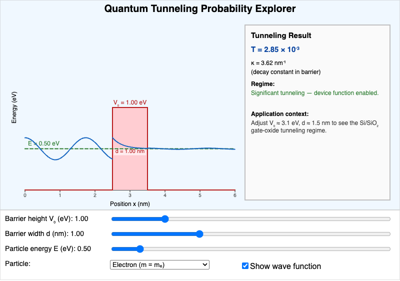

    Rectangular potential barrier with adjustable height V₀, width d,
    and incident energy E. Shows the wave function shape and the
    exact transmission probability T, including the gate-oxide
    leakage regime that drove high-κ dielectrics.

-   **[Quantum Well Energy Level Explorer](./quantum-well-explorer/index.md)**

    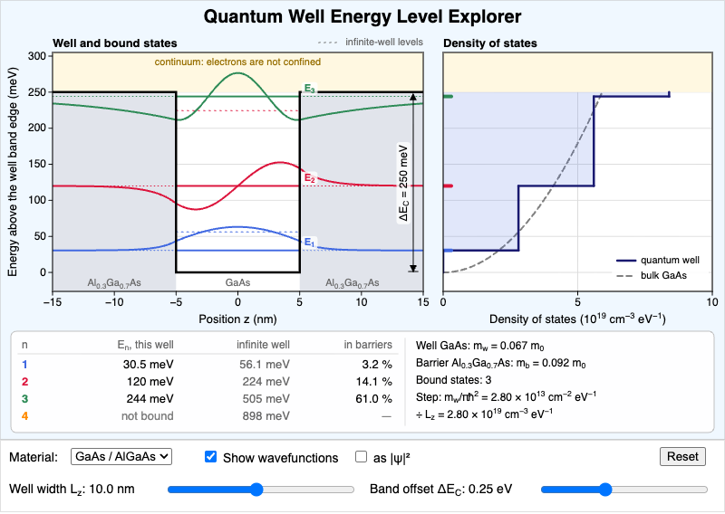

    Bound levels and wavefunctions of a finite quantum well for
    GaAs/AlGaAs, InGaAs/InP, and GaN/AlGaN, compared with the
    infinite-well formula. A second plot sets the staircase density
    of states of the well beside the bulk square-root curve.

-   **[Recombination Lifetime Explorer](./recombination-lifetime-explorer/index.md)**

    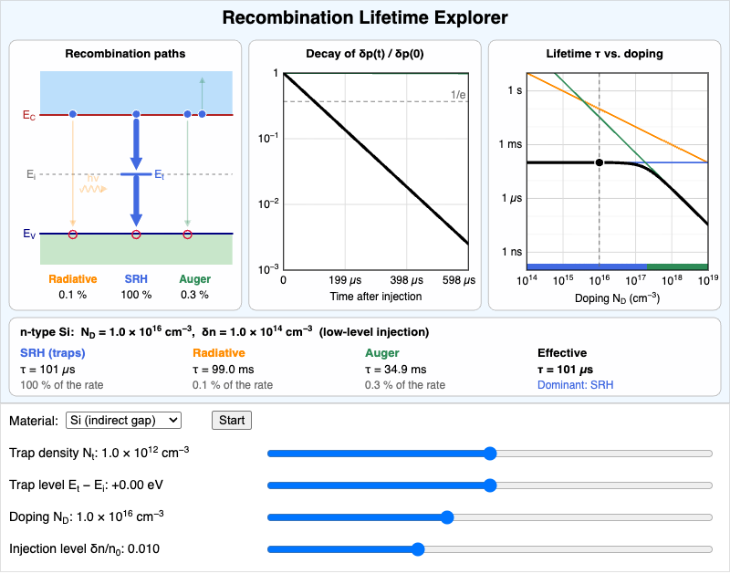

    Radiative, Shockley-Read-Hall, and Auger recombination side by
    side: a band diagram with each path's share of the rate, the
    decay of the excess carriers, and lifetime against doping for
    silicon and GaAs.

-   **[Semiconductor Lattice Constant and Bandgap Map](./lattice-bandgap-map/index.md)**

    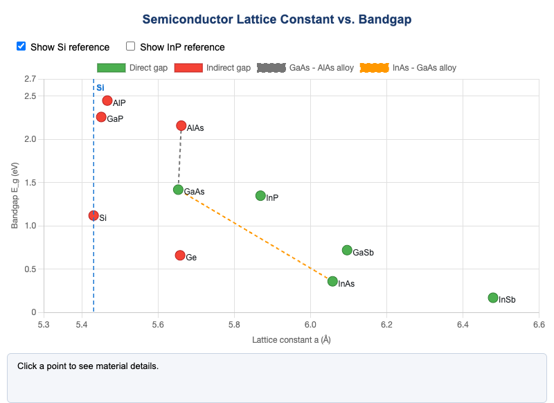

    Scatter plot of common III-V and group-IV semiconductors by
    lattice constant and bandgap. Direct-gap (green) vs indirect-gap
    (red) color coding with alloy interpolation lines for
    heterostructure design.

-   **[Solar Cell I-V Curve Explorer](./solar-cell-iv-explorer/index.md)**

    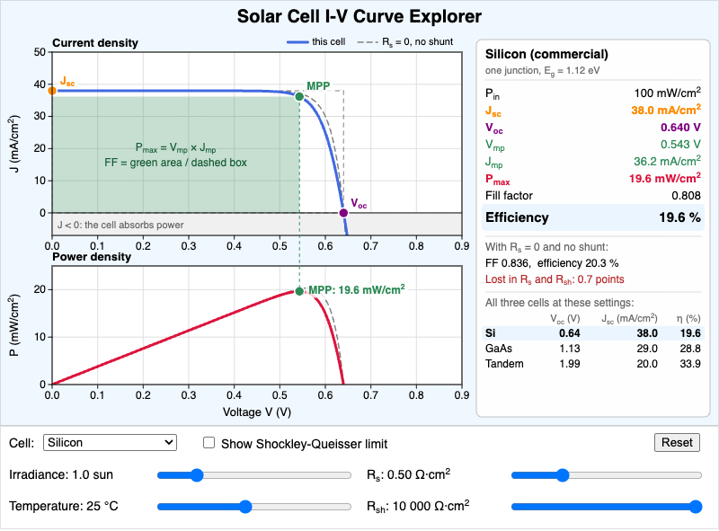

    Current and power against voltage for an illuminated solar cell,
    with the short-circuit current, open-circuit voltage, maximum
    power point, fill factor, and efficiency. Change irradiance,
    temperature, and the series and shunt resistances for silicon,
    GaAs, and a perovskite-silicon tandem.

-   **[Temperature Dependence of n_i Explorer](./intrinsic-concentration-temperature/index.md)**

    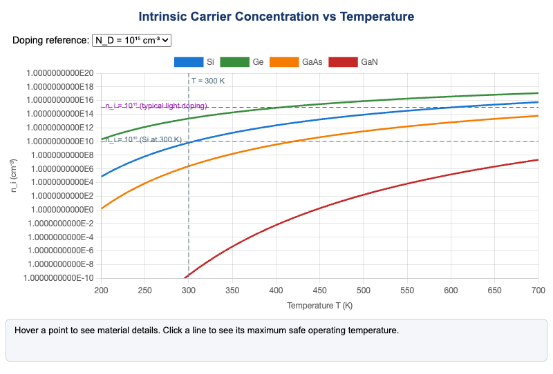

    Intrinsic carrier concentration n_i(T) on a log scale for Si,
    Ge, GaAs, and GaN from 200–700 K. Click a line to see the
    maximum safe operating temperature for a chosen doping level.

-   **[Velocity-Field Relationship Explorer](./velocity-field-explorer/index.md)**

    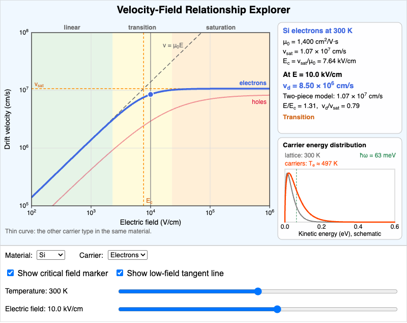

    Drift velocity against electric field for electrons and holes in
    Si, GaAs, and Ge on log-log axes. Shows the linear regime,
    velocity saturation, the critical field, and how the carrier
    energy distribution heats up at high field.

